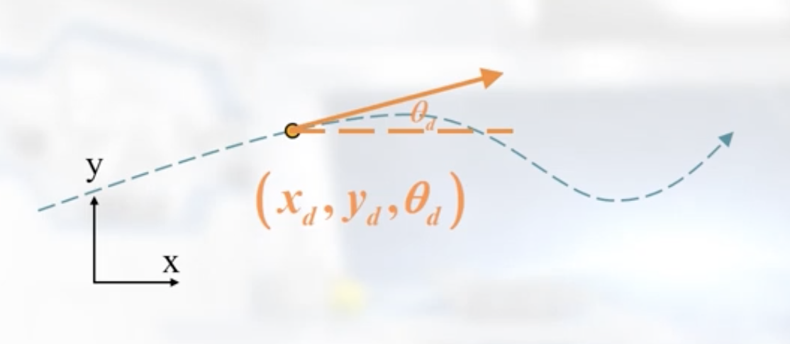
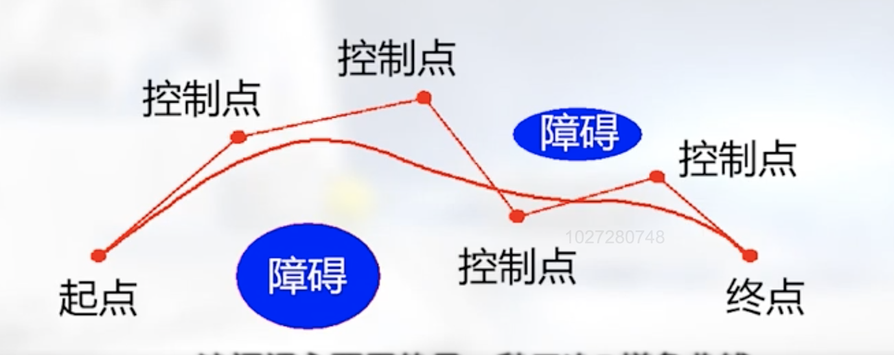

移动机器人的运动看作是控制问题
关注控制的输入、实际位置、预期位置

曲线切线的物理含义是速度增加的方向 theat_d

规划一条由起点到终点光滑的轨迹，通常使用三次B样条曲线

机器人坐标位置可以用其二维组坐标（x，y）的参数方程描述
$$ 
    P = \left[\begin{matrix} x(t) \\ y(t) \end{matrix} \right] 
      = \left[\begin{matrix} x(s) \\ y(s) \end{matrix} \right] 
$$

其中参数可以是时间，也可以是归一化路程
$$
    \theta = a \tan ({\dot{y}(t) \over \dot{x}(t)})
           = a \tan ({\dot{y}(s) \over \dot{x}(s)})
$$

e.g.1 给四个控制点[C1, C2, C3, C4], 则样条曲线为P(s), 参数满足0<=s<=1,可以看成是归一化路程 [相关代码](eg1.m)

$$
    P(s) = f_{1}(s)C_{1} + f_{2}(s)C_{2} + f_{3}(s)C_{3} + f_{4}(s)C_{4}
$$

如果有五个控制点[C1, C2, C3, C4, C5],
$$
    P(s) = \left[\begin{matrix} f_{1}(s) & \cdots & f_{4}(s) \end{matrix} \right] 
            \times 
            \left[\begin{matrix} 
            C_{1}  & C_{2}  & \cdots & C_{n-3}\\ 
            \vdots & \vdots & \ddots & \vdots \\
            C_{4}     & C_{5}     & \cdots & C_{n}
            \end{matrix} 
            \right]
$$
