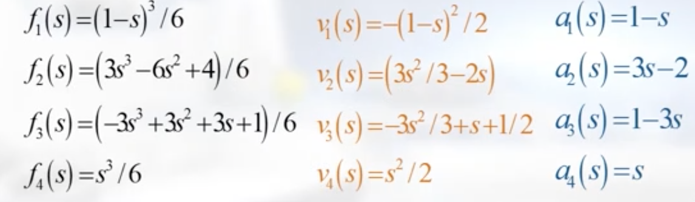

## B样条曲线的速度和加速度
$$ 
    P(s) = \left[\begin{matrix} x(t) \\ y(t) \end{matrix} \right] 
      = \left[\begin{matrix} x(s) \\ y(s) \end{matrix} \right] 
$$
    
$$
    V(s) = {\partial P(s) \over \partial s} = 
        \left[
            \begin{matrix} 
            v_{x}(s)\\
            v_{y}(s)
            \end{matrix}
        \right]
$$

$$
    A(s) = {\partial^2 P(s) \over \partial s^2} = 
        \left[
            \begin{matrix} 
            a_{x}(s)\\
            a_{y}(s)
            \end{matrix}
        \right]
$$

## 样条函数的微分


$$
    \left[
        \begin{matrix}
        P(s) \\
        V(s) \\
        A(s) 
        \end{matrix} 
    \right] 
    = 
        \left[
            \begin{matrix} 
            f_{1}(s) & \cdots & f_{4}(s) \\
            v_{1}(s) & \cdots & v_{4}(s) \\
            a_{1}(s) & \cdots & a_{4}(s)
            \end{matrix} 
        \right] 
        \left[
            \begin{matrix} 
            C_{1}  & C_{2}  & \cdots & C_{n-3}\\ 
            \vdots & \vdots & \ddots & \vdots \\
            C_{4}  & C_{5}  & \cdots & C_{n}
            \end{matrix} 
        \right]
$$
    
将起点C扩充保证样条曲线经过起点和终点
```
c1 = C1 - V1 * L
c2 = C1
c3 = C1 + V1 * L
V: 速度方向
L: 小车车长的一半
```
