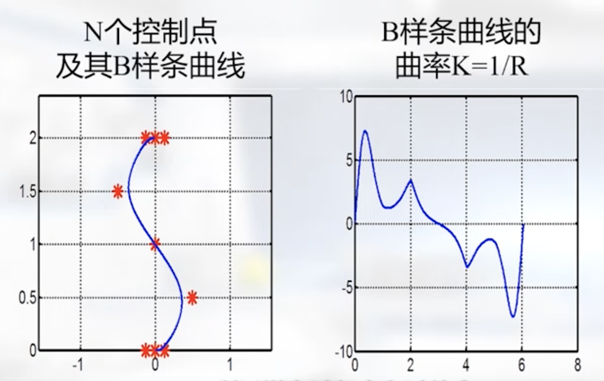
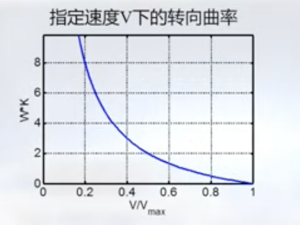
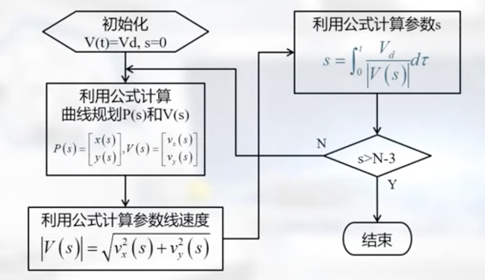
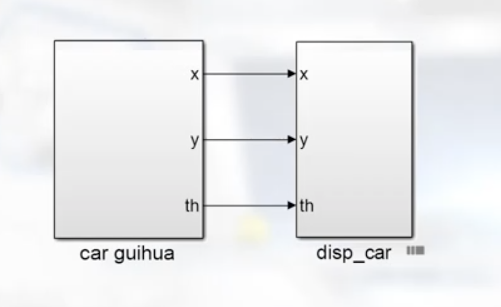
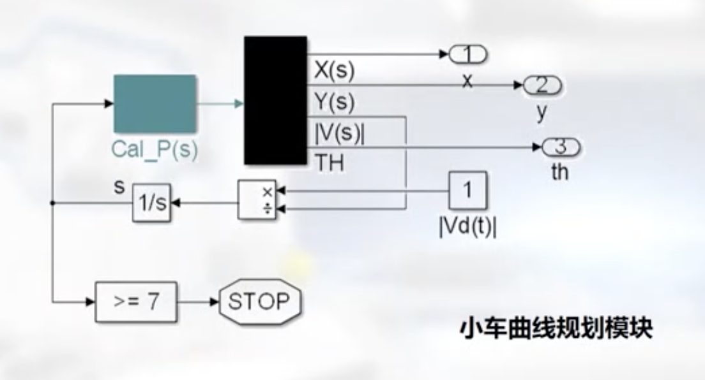
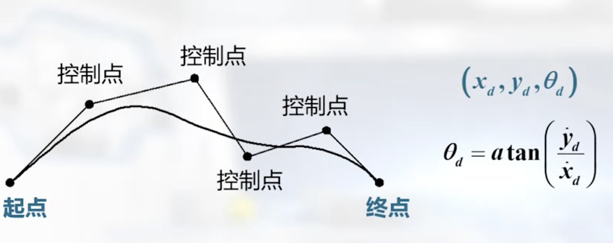
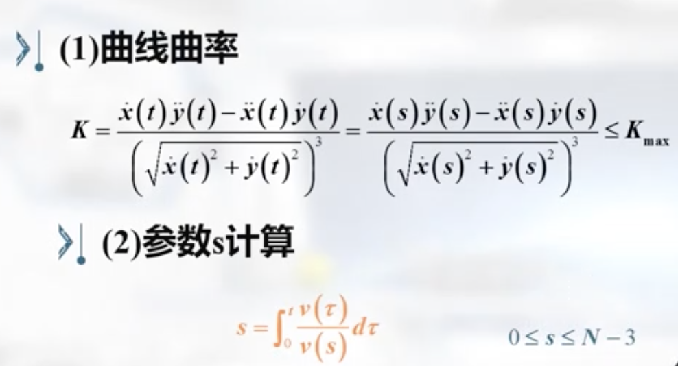

曲率：1/R

$$
    \kappa = 
    {1 \over R} = 
    {\dot{x}(t)\ddot{y}(t) - \ddot{x}(t)\dot{y}(t) \over {(\sqrt{\dot{x}(t)^2 + \dot{y}(t)^2}})^3} = 
    {\dot{x}(s)\ddot{y}(s) - \ddot{x}(s)\dot{y}(s) \over {(\sqrt{\dot{x}(s)^2 + \dot{y}(s)^2}})^3}

$$

对于车长为L的Car-Like小车，其最大曲率小于
$$ \kappa \leq {\tan \phi_{max} \over L} $$
其中$ \phi_{max}$ 为前轮的最大转向角
对于车宽为W的Tank-Like小车，其最大转向曲率为：
$$ \kappa \leq \frac{2}{W}[{V_{max} \over V} - 1] $$
前进速度越快，转向能力越弱

参数s与时间参数t的关系
$$
    {dP(t) \over dt} =
    {\partial P(s) \over \partial s} \times \dot{s} \Rightarrow
    \left[\begin{matrix} v_{x}(t) \\ v_{y}(t) \end{matrix} \right] =
    \left[\begin{matrix} v_{x}(s) \\ v_{y}(s) \end{matrix} \right] 
    \dot{s}(t)
$$
$$
    V(t) = V(s) \dot{s}
$$

小车·速度用参数t和参数s描述，有
$$
    \mid V(t) \mid = 
    \sqrt{v_{x}^{2}(t) + v_{y}^{2}(t)} 
$$
$$   
    \mid V(s) \mid = 
    \sqrt{v_{x}^{2}(s) + v_{y}^{2}(s)}
$$
显然：
$$
    \mid V(t) \mid =
    \mid V(s) \mid \dot{s}(t)
$$
可以通过下式计算参数s
$$
    s =
    \int_{0}^{t}{\mid V(t) \mid \over \mid V(s) \mid}d\tau
$$

## Simulink相关模块

$ TH = \theta $

